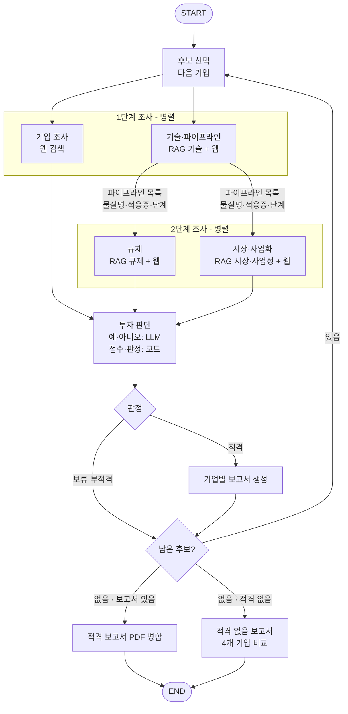

# AI Startup Investment Evaluation Agent
6조 : 김윤성, 정문기, 이승호, 이세영, 이준영

본 프로젝트는 **AI 신약개발(Healthcare AI) 스타트업**의 공개 근거를 수집하고, 기술·규제·시장·사업 위험을 기준으로 투자 적격성을 평가하는 에이전트를 설계하고 구현한 팀 프로젝트입니다.

현재 저장소에는 PDF 기반 Agentic RAG와 12개 위험요인 기반 투자 판단(Judge) 모듈이 포함되어 있습니다. 아래 전체 에이전트 구성과 그래프 흐름은 팀 설계서를 기준으로 작성했으며, 조사·보고서 모듈의 실제 파일 구성은 통합 후 갱신할 예정입니다.

## Overview

- **Objective**: AI 신약개발 스타트업의 경영진, 사업 단계, 기술, 규제, 제조, 시장성, 경쟁력, 자금 조달, 해외 진출, 평판, 소송 및 투자금 회수 가능성을 바탕으로 투자 적격성을 분석합니다.
- **Method**: LangGraph, Agentic RAG, 구조화 출력, 코드 기반 점수 계산 및 Stage-Gate 방식의 판정 규칙을 사용합니다.
- **Evaluation**: Risk Factor Summation Method(RFSM)의 12개 위험요인과 5단계 척도를 차용한 위험평가표를 사용합니다. 기업가치 산정이 아니라 투자 위험 판단을 목적으로 합니다.
- **Verdict**: 기업을 `적격`, `보류`, `부적격`으로 분류하고, 보류 기업에는 재검토 조건을 제시합니다.

## Features

### RAG

- 규제·기술·시장 분야의 공식 보고서 및 논문 6종, 총 134쪽을 검색 대상으로 사용합니다.
- PyMuPDF로 PDF의 텍스트와 쪽 번호를 추출합니다.
- 표·그래프·이미지 페이지는 비전 LLM으로 전사하고 원문 대조가 필요한 수치를 구분합니다.
- 한국어와 영어 검색 질문을 생성하여 다국어 문서를 검색합니다.
- FAISS 검색 결과를 LLM이 다시 관련성 평가합니다.
- 관련 근거가 없으면 검색 질문을 한 번 재작성한 뒤 다시 검색합니다.
- 청킹 5종, 임베딩 3종, 검색 방식 3종을 동일한 평가셋으로 비교해 검색 설정을 선택합니다.
- 검색 근거와 함께 문서명, 페이지, 청크 ID 및 유사도 점수를 반환합니다.

### Multi-Agent Workflow

- 후보 4곳을 판정과 관계없이 모두 평가합니다.
- 기업 조사와 기술·파이프라인 조사를 먼저 병렬로 실행합니다.
- 기술·파이프라인 에이전트가 찾은 물질명·적응증·개발 단계 목록을 규제와 시장·사업화 에이전트에 전달합니다.
- 규제와 시장 조사는 회사 이름이 아니라 물질·적응증 단위로 수행합니다.
- 네 조사 영역이 끝난 뒤 투자 판단을 한 번 실행합니다.
- 적격 기업마다 개별 보고서를 생성하되 다음 후보 평가를 계속합니다.
- 적격 기업이 없으면 네 기업의 판정 사유와 재검토 조건을 비교한 보고서를 생성합니다.

### Judge

- RFSM의 12개 위험요인을 차용하여 기업 위험을 평가합니다.
- 기술과 법률·정책 항목을 필수 관문으로 적용합니다.
- LLM은 각 항목의 사실 여부와 근거 ID를 구조화된 형식으로 반환합니다.
- 실제 점수 계산, 합산 및 최종 판정은 Python 코드가 수행합니다.
- 근거를 `확인됨`, `기업 주장만`, `찾지 못함`, `상충함`으로 구분합니다.
- 하나의 근거가 여러 평가 항목에 중복 반영되지 않도록 제한합니다.
- 기준점 `+5`와 함께 `+4`, `+6`에 대한 민감도 분석을 제공합니다.
- 비관문 영역을 포함해 조사 근거가 부족한 경우 보류 및 재검토 조건을 생성합니다.

## Tech Stack

- **Language**: Python
- **Framework**: LangGraph, LangChain
- **LLM / Generator**: Gpt4.1-mini
- **LLM / Relevance Grader**: Gpt4o-mini
- **LLM / Vision Parser**: Gpt4.1-mini
- **LLM / Judge**: Gpt4.1-mini
- **PDF Parsing**: PyMuPDF
- **Retrieval**: FAISS — Hit Rate@3 **0.824**, MRR **0.703**
- **Embedding**: `BAAI/bge-m3`
- **Korean Tokenizer**: Kiwi
- **Structured Output**: Pydantic
- **Test**: pytest

## Agents

### 1. Candidate Selector

평가 대상 기업을 순서대로 선택하는 코드 기반 노드입니다.

- 스탠다임, 디어젠, 갤럭스, 닥터노아바이오텍을 차례로 선택합니다.
- 이전 기업의 판정과 관계없이 네 기업을 모두 평가합니다.
- 현재 후보 번호와 남은 후보 존재 여부를 관리합니다.
- 새 기업을 선택할 때 파이프라인 정보를 초기화해 이전 기업의 값이 남지 않게 합니다.

### 2. Company Research Agent

기업과 팀 자체의 위험을 조사합니다.

- **평가 항목**: 경영진, 자금 조달, 평판
- **주요 출처**: 기업 홈페이지, 인터뷰, 투자 기사, THE VC, 혁신의숲
- 창업 전 전문성과 창업 후 핵심 인력 영입 여부를 구분해 확인합니다.
- 최근 투자 유치와 자금난·구조조정 보도를 조사합니다.
- 정부 과제, 공신력 있는 수상, 연구 부정 및 부정 보도를 확인합니다.
- 검색 결과의 요약문이 아니라 원문 페이지를 열어 관련 문단, 발행일 및 접근일을 근거로 저장합니다.

### 3. Technology & Pipeline Agent

AI 플랫폼의 기술 검증 수준과 신약 파이프라인을 조사합니다.

- **평가 항목**: 기술, 사업 단계, 제조
- **사용 도구**: 기술 문서 RAG, 웹 검색, 원문 확인
- AI 발굴 물질의 전임상·임상 결과와 동료심사 논문을 확인합니다.
- 파이프라인별 물질명, 적응증, 개발 단계를 구조화된 목록으로 만듭니다.
- 임상용 물질의 GMP 생산 및 CDMO 계약 여부를 조사합니다.
- 생성한 파이프라인 목록을 규제 및 시장·사업화 에이전트에 전달합니다.

### 4. Regulation Agent

파이프라인별 규제 진행 상황과 법률 위험을 조사합니다.

- **평가 항목**: 법률·정책, 해외, 소송
- **사용 도구**: 규제 문서 RAG, 웹 검색, 원문 확인
- FDA IND 효력 발생, 식약처 임상시험계획 승인, Clinical Hold 및 반려 여부를 확인합니다.
- FDA 희귀의약품·신속심사 지정 요건은 RAG에서 찾고, 실제 지정 여부는 물질별 웹 근거로 확인합니다.
- 특허 등록, 특허 분쟁 및 소송 정보를 조사합니다.
- 해외 기술이전, 해외 공동연구 및 해외 임상 진행 여부를 확인합니다.

### 5. Market & Commercialization Agent

파이프라인의 시장성과 사업화·회수 가능성을 조사합니다.

- **평가 항목**: 영업·마케팅, 경쟁, 투자금 회수
- **보조 정보**: 적응증별 시장 규모
- **사용 도구**: 시장·사업성 문서 RAG, 웹 검색, 원문 확인
- 기술이전 계약, 공동연구, 계약금 공개 및 계약 해지 여부를 조사합니다.
- 적응증별 시장 규모와 경쟁 약물을 확인합니다.
- 자체 데이터, 특허 및 실험 검증을 기준으로 플랫폼 차별성을 조사합니다.
- 기술성평가, 상장 예비심사, 상장 철회 등 투자금 회수 경로를 확인합니다.

### 6. Agentic RAG

규제·기술·시장 문서에서 투자 판단에 필요한 기준, 제도 및 통계를 검색합니다.

1. 사용자 질문과 파이프라인 정보를 바탕으로 한국어·영어 검색 질문을 생성합니다.
2. `doc_type`에 따라 규제, 기술, 시장 문서를 분리하여 검색합니다.
3. FAISS에서 관련 청크를 조회합니다.
4. LLM이 검색 결과에 질문의 답이 직접 포함되어 있는지 평가합니다.
5. 관련 근거가 없으면 검색 질문을 한 번 재작성합니다.
6. 최종적으로 관련 청크와 문서명·페이지를 반환하며, 찾지 못한 경우 빈 목록을 반환합니다.

### 7. Investment Judge

조사 에이전트가 수집한 기업별 근거를 사용해 12개 항목을 평가합니다.

| 조사 영역 | 평가 항목 |
| --- | --- |
| 기업·팀 | 경영진, 자금 조달, 평판 |
| 기술·파이프라인 | 사업 단계, 제조, 기술(관문) |
| 규제 | 법률·정책(관문), 소송, 해외 |
| 시장·사업화 | 영업·마케팅, 경쟁, 투자금 회수 |

Judge LLM은 항목마다 네 질문에 예·아니오로 답하고 근거 ID를 선택합니다.

1. `-2` 기준의 나쁜 사실이 확인되었는가?
2. `+2` 기준의 사실이 확인된 근거로 존재하는가?
3. `+2` 기준의 일부만 있거나 기업 주장만 존재하는가?
4. 지연·축소·분쟁 조짐과 같은 우려 신호가 있는가?

점수 변환, 합산 및 최종 판정은 결정론적인 코드가 수행합니다. 기술과 법률·정책 관문, 네 조사 영역의 근거 존재 여부, 합계 `+5` 기준을 차례로 검사해 `적격`, `보류`, `부적격`을 결정합니다.

### 8. Report Generator

투자 판단 결과와 실제 사용한 근거만 이용해 기업별 투자 보고서를 작성합니다.

- 적격 기업마다 5쪽 이내의 개별 보고서를 생성합니다.
- 적격 보고서를 만든 뒤에도 다음 후보 평가를 계속합니다.
- 적격 기업이 여러 곳이면 생성한 PDF를 평가 순서대로 하나로 합칩니다.
- 적격 기업이 없으면 네 기업의 판정, 부적격·보류 사유 및 재검토 조건을 비교한 보고서를 생성합니다.
- SUMMARY는 본문 작성 후 마지막에 압축하며 판정, 합계, 핵심 이유와 재검토 조건을 포함합니다.
- 실제로 인용한 출처만 REFERENCE에 수록합니다.
- 조사 근거가 없거나 상충하거나 기업 주장에만 의존한 항목은 한계점에 기록합니다.

## Architecture



투자 판단은 기업 조사, 규제, 시장·사업화가 모두 끝난 뒤 기업당 한 번 실행합니다. 적격 판정이 나와도 평가를 중단하지 않으며 종료 조건은 후보 4곳의 평가 완료입니다.

## Directory Structure

```
AI_Investment_project-develop/
├── agents/                    # 조사 에이전트 모듈(통합 예정)
│   ├── __init__.py            # 패키지 설명 (기업별 조사 노드)
│   ├── common.py              # 공통 조사 로직 (검색 · 원문 검증 · 근거 변환)
│   ├── select_candidate.py    # 평가 순서대로 다음 기업 선택
│   ├── company.py             # 경영진 · 자금 조달 · 평판 조사
│   ├── tech_pipeline.py       # 기술 검증 · 사업 단계 · 제조 · 물질별 파이프라인 조사
│   ├── regulation.py          # 물질·적응증 단위 규제 · 소송 · 해외 진행 조사
│   └── market.py              # 물질·적응증 단위 시장 · 경쟁 · 사업화 · 투자금 회수 조사
├── data/
│   ├── raw/                   # 원본 PDF 6종
│   ├── processed/             # 파싱·청킹·비전 전사 결과
│   ├── index/                 # FAISS 인덱스
│   └── eval/                  # 검색 평가셋과 실험 결과
├── judge/
│   ├── node.py                # Judge LLM 호출과 State 결과 생성
│   ├── rubric.py              # 12개 위험요인 평가 기준
│   ├── schema.py              # LLM 구조화 출력 스키마
│   └── scorer.py              # 점수·판정·민감도 계산
├── prompts/
│   └── judge.md               # 투자 판단 프롬프트
├── rag/
│   ├── build_index.py         # 임베딩 및 FAISS 인덱스 생성
│   ├── eval_retriever.py      # Hit Rate@K·MRR 평가
│   ├── experiment.py          # 청킹·임베딩·검색 방식 비교
│   ├── parse_pdfs.py          # PDF 파싱 및 청킹
│   ├── prepare.py             # RAG 준비 과정 통합 실행
│   ├── rag_search.py          # Agentic RAG 검색 그래프
│   ├── retriever.py           # BM25·FAISS·앙상블 검색기
│   ├── settings.py            # 최적 검색 설정
│   ├── sources.py             # 문서 출처와 doc_type
│   └── vision.py              # 표·그래프·이미지 전사
├── report/                    # 보고서 생성 모듈(통합 예정)
├── tests/                     # Graph·RAG·Judge 테스트
├── tools/
│   └── evidence.py            # Evidence·Pipeline 공통 타입
├── config.py                  # 후보·평가 항목·판정 기준 설정
├── graph.py                   # 전체 LangGraph 조립
├── state.py                   # LangGraph 공유 State
├── requirements.txt           # Python 의존성
└── README.md
```

## Usage

### 1. 환경 준비

```bash
python -m venv .venv
source .venv/bin/activate
pip install -r requirements.txt
```

`.env` 파일에 OpenAI API 키를 설정합니다.

```
OPENAI_API_KEY=your_openai_api_key
```

### 2. RAG 준비

```bash
python -m rag.prepare
```

저장소에 비전 전사 캐시가 포함되어 있어 RAG 준비 과정은 API 키 없이 실행할 수 있습니다. 최초 실행 시 `BAAI/bge-m3` 모델 약 2.3GB를 다운로드합니다.

### 3. RAG 검색

```python
from rag.rag_search import rag_search

hits = rag_search(
    "희귀의약품 지정이 신약 개발 위험에서 어떤 의미인가?",
    "regulation",
)

for hit in hits:
    print(hit["doc"], hit["page"], hit["text"])
```

`doc_type`은 `regulation`, `tech`, `market` 중 하나를 사용합니다.

### 4. 검색 설정 실험

```bash
python -m rag.experiment
```

실험 결과는 `data/eval/results.md`와 `data/eval/best_config.json`에 저장됩니다.

### 5. 테스트

```bash
pytest
```

전체 에이전트 실행 명령은 조사·보고서 모듈 통합 후 추가할 예정입니다.

## Retrieval Evaluation

평가셋 34문항에 대해 정답 문서·페이지를 기준으로 검색 성능을 측정했습니다.

| 설정 | 값 |
| --- | --- |
| Chunking | 500자, 50자 overlap (`r500`) |
| Embedding | `BAAI/bge-m3` |
| Retrieval | FAISS |
| Hit Rate@3 | **0.824** |
| MRR | **0.703** |

설계 단계에서는 BM25와 Dense 검색을 결합한 하이브리드 검색을 가정했으나, 실제 평가에서는 FAISS 단독 검색이 BM25 및 앙상블보다 높은 성능을 보여 최종 설정으로 선택했습니다. 세부 결과는 `data/eval/results.md`에서 확인할 수 있습니다.

## Contributors

- 김윤성: RAG 문서·검색 파이프라인, 문서 수집·전처리, 임베딩 처리, `rag_search` 도구 제작
- 이세영: 에이전트 그래프, LangGraph State·조건 분기·병렬 실행 구현, 에이전트 제작, 채점·판정 로직
- 이승호: RAG 문서·검색 파이프라인, 문서 수집·전처리, 임베딩 처리, `rag_search` 도구 제작
- 이준영: RAG 문서·검색 파이프라인, 문서 수집·전처리, 임베딩 처리, `rag_search` 도구 제작
- 정문기: 에이전트 그래프, LangGraph State·조건 분기·병렬 실행 구현, 에이전트 제작, 채점·판정 로직
